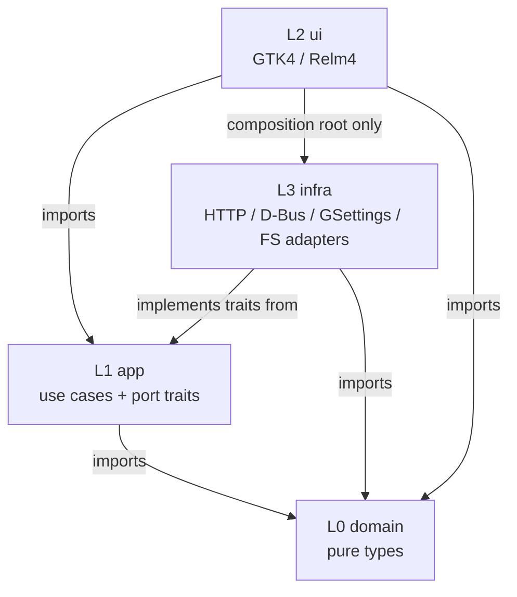

# Architecture

GNOME X is built on **Tree Architecture** — a hexagonal / clean architecture
variant where dependencies flow strictly inward through layers, and every
external surface (HTTP API, D-Bus, GSettings, filesystem) is reached through
a *port trait* implemented by a *concrete adapter*.

This page is the conceptual map. For implementation, see
[`crates/`](https://github.com/leechristophermurray/gnome-x/tree/main/crates)
in the repo.

## The four crates

```
crates/
  domain/   L0  Pure types, value objects, business rules     (zero deps)
  app/      L1  Use cases and port (trait) definitions         (depends only on domain)
  infra/    L3  HTTP, D-Bus, GSettings, filesystem adapters    (depends on app + domain)
  ui/       L2  GTK4 / Libadwaita / Relm4 application binary   (depends on app + domain + infra)
```

The numeric layer labels (L0, L1, L2, L3) are an internal convention — the
*relationships* between them are what matter.



## The fundamental rule

**Dependencies flow inward only.**

| Crate    | May import from                  |
|----------|----------------------------------|
| `domain` | nothing external                  |
| `app`    | only `domain`                    |
| `infra`  | `domain`, `app` (to implement port traits) |
| `ui`     | `domain`, `app`; `infra` **only in the composition root** (`crates/ui/src/services.rs`) |

Inverting any of these arrows is a code review failure. The rule is not
mechanically enforced (no compile-time barrier exists in Rust without a
build script), but it's enforced by convention and by the fact that almost
every PR review catches violations early.

## Ports and adapters

Every external dependency is abstracted behind a **port trait** in
[`crates/app/src/ports/`][ports] and implemented by a concrete **adapter**
in [`crates/infra/src/`][infra].

[ports]: https://github.com/leechristophermurray/gnome-x/tree/main/crates/app/src/ports
[infra]: https://github.com/leechristophermurray/gnome-x/tree/main/crates/infra/src

| Port (trait)          | Adapter (impl)              | What it does                       |
|-----------------------|-----------------------------|------------------------------------|
| `ExtensionRepository` | `EgoClient`                 | extensions.gnome.org HTTP API      |
| `ContentRepository`   | `OcsClient`                 | gnome-look.org OCS API             |
| `ShellProxy`          | `DbusShellProxy`            | GNOME Shell `org.gnome.Shell.Extensions` D-Bus interface |
| `LocalInstaller`      | `FilesystemInstaller`       | Install / uninstall content under XDG dirs |
| `AppearanceSettings`  | `GSettingsAppearance`       | Read / write `org.gnome.desktop.interface` |
| `PackStorage`         | `PackTomlStorage`           | Persist Experience Packs as TOML   |
| `ThemeCssGenerator`   | per-Shell-version impls     | Render Theme Builder values into GTK CSS |
| `FilesystemThemeWriter` | `FilesystemThemeWriter`   | Write `~/.config/gtk-{3,4}.0/gtk.css` |
| `ShellCustomizer`     | per-Shell-version impls     | Write Shell theme CSS, manage user theme extension |
| `ExternalAppThemer`   | `ChromiumThemer`, `VscodeThemer` | Push our palette into Chrome/VS Code config |
| `ThemingConflictDetector` | `GioThemingConflictDetector` | Detect competing theme tools (see [conflicts tutorial](../tutorials/theming-conflicts.md)) |

To add a new external surface (say, a new theme source), you:

1. Define the port trait in `crates/app/src/ports/`
2. Re-export it from `crates/app/src/ports/mod.rs`
3. Implement the adapter in `crates/infra/src/`
4. Wire it into `AppServices` in `crates/ui/src/services.rs`

## Use cases

Business logic lives in **use case** types in
[`crates/app/src/use_cases/`][usecases]. Each use case takes its
dependencies as `Arc<dyn Port>` constructor parameters and exposes a small,
intention-revealing API:

[usecases]: https://github.com/leechristophermurray/gnome-x/tree/main/crates/app/src/use_cases

```rust
let apply_theme = ApplyThemeUseCase::new(generator, writer, appearance)
    .with_external_themer(Arc::new(VscodeThemer::new()))
    .with_external_themer(Arc::new(ChromiumThemer::new()));

apply_theme.apply(&theme_spec)?;
```

This pattern means:

- **Tests** can substitute fake adapters with no GTK, no network, no D-Bus.
  Most of the test suite under `crates/app/tests/` runs in milliseconds
  with zero environmental setup.
- **The UI** is dumb — it builds a `ThemeSpec` from current GSettings
  values, hands it to the use case, and renders the result.
- **The CLI** (`experiencectl`) uses the *same* use cases as the UI. See
  [`crates/cli/src/main.rs`](https://github.com/leechristophermurray/gnome-x/blob/main/crates/cli/src/main.rs)
  — it's just an alternate driver of the same composition root.

## Composition root

The single place that *knows* about every adapter is
[`crates/ui/src/services.rs`][services] (`AppServices::new()`). It
constructs each adapter, wires it into the use case that needs it, and
hands the bundle to the Relm4 components.

[services]: https://github.com/leechristophermurray/gnome-x/blob/main/crates/ui/src/services.rs

The CLI does the same wiring in
[`crates/cli/src/main.rs`](https://github.com/leechristophermurray/gnome-x/blob/main/crates/cli/src/main.rs).
The two composition roots are intentionally similar — if you change one
construction, the other usually needs the same change.

## Where Relm4 fits

Inside `crates/ui/src/components/`, each tab and dialog is a Relm4
component. Components talk to use cases through the `AppServices` they're
handed. They never construct adapters or use cases themselves — they just
*invoke* them.

The Relm4 message types live in the same component file as the model and
view. There's no shared global state — every component owns its own
`Model`.

## What this buys us

| Property                          | How the architecture provides it                    |
|-----------------------------------|-----------------------------------------------------|
| **Testability**                   | Use cases run with fakes; no GTK display required for L0/L1 tests |
| **Swappability**                  | Replacing extensions.gnome.org with a different source is one new adapter, no UI changes |
| **Multiple drivers**              | The same use cases serve the GTK UI and the CLI    |
| **Failure isolation**             | An adapter that breaks (say, gnome-look.org's OCS schema changes) only affects its adapter file — UI tabs that don't use it stay working |
| **Honest error reporting**        | Use cases return typed `AppError` variants; the UI maps them to toasts; the CLI maps them to exit codes |

## What it costs

| Cost                              | Mitigation                                          |
|-----------------------------------|-----------------------------------------------------|
| Extra files per feature           | Templates in `CONTRIBUTING.md` show the steps      |
| Indirection between port and adapter | The port is the API contract; reading the trait usually answers the question |
| Composition root grows over time  | Acceptable. It's the one place that's allowed to know everything. |

## Where to go next

- [Experience Packs](experience-packs.md) — see how the pack model fits the
  port/adapter layout.
- [Why no Flatpak](no-flatpak.md) — the architectural reason for the
  packaging decision.
- [Pack TOML reference](../reference/pack-toml.md), [GSettings reference](../reference/gsettings.md), [CLI reference](../reference/cli.md) — concrete artefacts the architecture produces.
