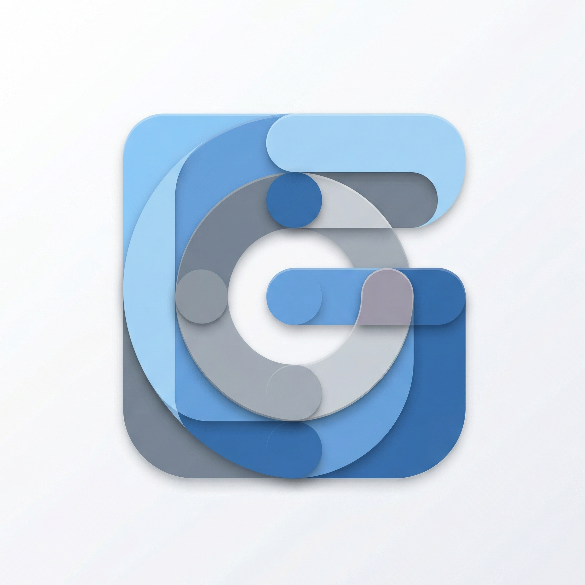
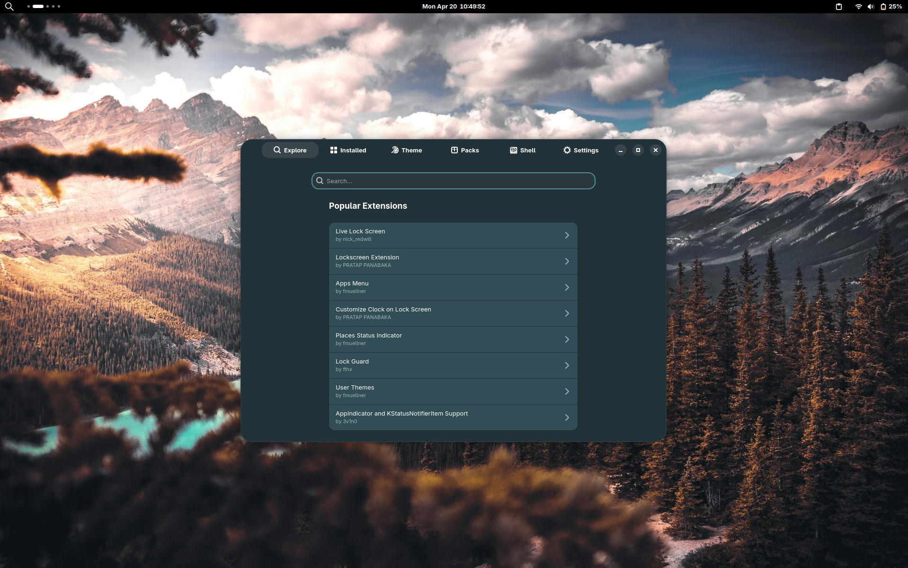

  

# GNOME X

**One app for everything you'd otherwise tweak across five tools.**

GNOME X brings GNOME Shell extensions, GTK themes, icon packs, cursor themes,
and **Experience Packs** into a single GTK4 / Libadwaita application that
follows the GNOME Human Interface Guidelines from end to end.

[Install GNOME X →](install.md){ .md-button .md-button--primary }
[Try the first tutorial →](tutorials/extensions.md){ .md-button }

---

## What it does

=== "Browse"

    Search and install **GNOME Shell extensions** from extensions.gnome.org and
    **themes / icons / cursors** from gnome-look.org without ever leaving the
    app. The landing page surfaces popular and recently-updated items so you
    can discover what's good without knowing what to look for.

=== "Customize"

    Pick a theme, drop in an icon pack, swap your cursor, change the accent
    colour — every choice is applied through GSettings the way GNOME's own
    Settings app would do it. No `gsettings set` incantations, no manual
    `~/.themes/` archaeology.

=== "Snapshot"

    Bundle your **entire desktop** — theme, icons, cursor, wallpaper, enabled
    extensions, theme-builder values — into a single
    `.gnomex-pack.tar.gz` file. Share it. Reproduce someone else's setup with
    one click. Roll back to your old look the same way.

## Why this exists

A polished GNOME desktop today usually means a 30-minute tutorial:

1. Find a theme on gnome-look.org
2. Download the right zip
3. Extract it to `~/.themes/`
4. Open Tweaks (or run `gsettings set`) to apply it
5. Repeat for icons, cursors, shell theme, fonts
6. Hunt down each extension on extensions.gnome.org
7. Install a browser extension to install browser extensions
8. Pray nothing breaks on the next GNOME release

GNOME X collapses that into a few clicks and lets you save the result as a
**reusable Experience Pack** so you (or anyone else) can recreate it in one
step.

## Built for GNOME, not on top of it

- **GTK 4 + Libadwaita 1.5+** — adaptive layout from 360 px phone-narrow to
  ultrawide, full dark / light / accent colour scheme support, Adwaita widgets
  end to end (`AdwViewSwitcher`, `AdwToastOverlay`, `AdwActionRow`,
  `AdwAlertDialog`).
- **Hexagonal architecture** — each external surface (extensions.gnome.org,
  gnome-look.org, GNOME Shell D-Bus, GSettings, filesystem) is a swappable
  adapter behind a port trait. See [Architecture](concepts/architecture.md).
- **No Flatpak** — by design. GNOME X writes to host paths the sandbox
  blocks, and pretending otherwise would mean shipping a sandbox with so
  many holes it adds nothing. See [Why no Flatpak](concepts/no-flatpak.md).

## Status

| Surface         | State                                 |
|-----------------|---------------------------------------|
| Explore         | extensions.gnome.org + gnome-look.org |
| Install         | extensions, GTK themes, icons, cursors |
| Customize       | accent, scheme, theme, icons, cursor  |
| Theme builder   | radius, opacity, tint, headerbar, insets, layer separation, per-widget colours |
| Experience Packs | export / import / apply               |
| Conflict detection | recent — see [its tutorial](tutorials/theming-conflicts.md) |
| Flatpak         | not supported (intentional)           |
| Login screen (GDM) | tracked, not yet shipped           |

## Community

- **[r/GNOME_eXperience](https://www.reddit.com/r/GNOME_eXperience/)** — the
  subreddit for sharing Experience Packs, screenshots of customised
  desktops, and general discussion. The best place to post a pack you've
  built for other people to find.
- **[GitHub issues](https://github.com/leechristophermurray/gnome-x/issues)**
  — bug reports, feature requests, and architecture discussion. Use this
  for anything actionable; use the subreddit for anything conversational.

## Where to go next

- New here? [Install GNOME X](install.md), then read [First run](first-run.md).
- Want a guided walk-through? Start with the
  [extension install tutorial](tutorials/extensions.md).
- Looking for the technical model? See [Architecture](concepts/architecture.md).
- Hit a rough edge? Read
  [Known limitations](known-limitations.md) — every honest workaround is in there.
