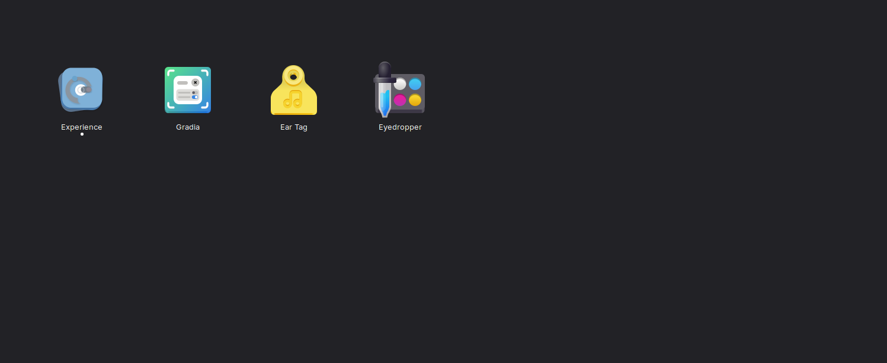

# Install GNOME X

GNOME X runs on any modern GNOME desktop with **GNOME Shell 45 or later**,
**GTK 4.14+**, and **Libadwaita 1.5+**. Pick the path that matches your
distribution.

!!! warning "Flatpak is not supported"
    There is no Flatpak build of GNOME X and there will not be one. The reasons
    are structural, not cosmetic — see [Why no Flatpak](concepts/no-flatpak.md)
    for the full rationale. Use one of the install paths below instead.

## From a release package

If a `.deb` or `.rpm` is available for your distribution on the
[Releases page][releases], that is the simplest path:

[releases]: https://github.com/leechristophermurray/gnome-x/releases

=== "Fedora / RHEL"

    ```sh
    sudo dnf install ./gnome-x-*.rpm
    ```

=== "Ubuntu / Debian"

    ```sh
    sudo apt install ./gnome-x_*.deb
    ```

After installation, launch **GNOME X** from your applications menu.

## From source

You will need:

- Rust **stable** toolchain, 2024 edition
- GTK 4 and Libadwaita development headers
- `pkg-config`, a C compiler

=== "Fedora / RHEL"

    ```sh
    sudo dnf install gtk4-devel libadwaita-devel gcc pkg-config
    ```

=== "Ubuntu / Debian"

    ```sh
    sudo apt install libgtk-4-dev libadwaita-1-dev build-essential pkg-config
    ```

=== "Arch Linux"

    ```sh
    sudo pacman -S gtk4 libadwaita rust pkgconf
    ```

Install Rust if you don't have it:

```sh
curl --proto '=https' --tlsv1.2 -sSf https://sh.rustup.rs | sh
```

Then clone and build:

```sh
git clone https://github.com/leechristophermurray/gnome-x.git
cd gnome-x
cargo build --release -p gnomex-ui
```

The compiled binary lives at `target/release/gnomex-ui`. To install it
system-wide along with the desktop file, AppStream metadata, GSettings schema,
and icons:

```sh
sudo ./install.sh
```

This places the binary at `/usr/local/bin/gnome-x`. To install under `/usr`
instead:

```sh
PREFIX=/usr sudo ./install.sh
```

!!! tip "Run from the source tree without installing"
    For development or to try GNOME X without touching system paths:

    ```sh
    cargo run -p gnomex-ui
    ```

    The app registers a custom icon search path at startup so the app icon
    loads correctly even before installation.

## With cargo install

```sh
cargo install --path crates/ui
```

This installs **only the binary** — the `.desktop` file, AppStream metainfo,
GSettings schema, and icons are not placed. If you go this route, run
`install.sh` separately to add desktop integration:

```sh
sudo ./install.sh --bin-only-skip
```

## After installing

Launch GNOME X from your applications grid (or run `gnome-x` from a terminal),
then continue with [First run](first-run.md).



## Verifying the install

Run the bundled CLI to confirm GNOME X can talk to GNOME Shell:

```sh
experiencectl status
```

You should see something like:

```
=== GNOME X Status ===
Shell version:         47.2
Accent color:          blue
Color scheme:          default
Scheduled accent:      off
Shared tinting:        false
Window radius:         12px
Element radius:        9px
Panel opacity:         100%
Tint intensity:        0%
```

If `Shell version` is missing, GNOME X could not reach the
`org.gnome.Shell.Extensions` D-Bus interface — usually because you're running
under a non-GNOME session (X11 KDE, sway, GNOME Classic on a *very* old
release). The GUI will still launch but extension management will be disabled.

## Uninstall

```sh
sudo ./install.sh uninstall
```

Removes the binary, desktop file, AppStream metainfo, GSettings schema, and
hicolor icons. **User configuration is preserved** — your saved Experience
Packs in `~/.local/share/gnome-x/packs/`, your GTK overrides in
`~/.config/gtk-4.0/gtk.css`, and your installed themes / icons remain. To
fully reset, see [the GSettings reference](reference/gsettings.md#resetting-everything).
