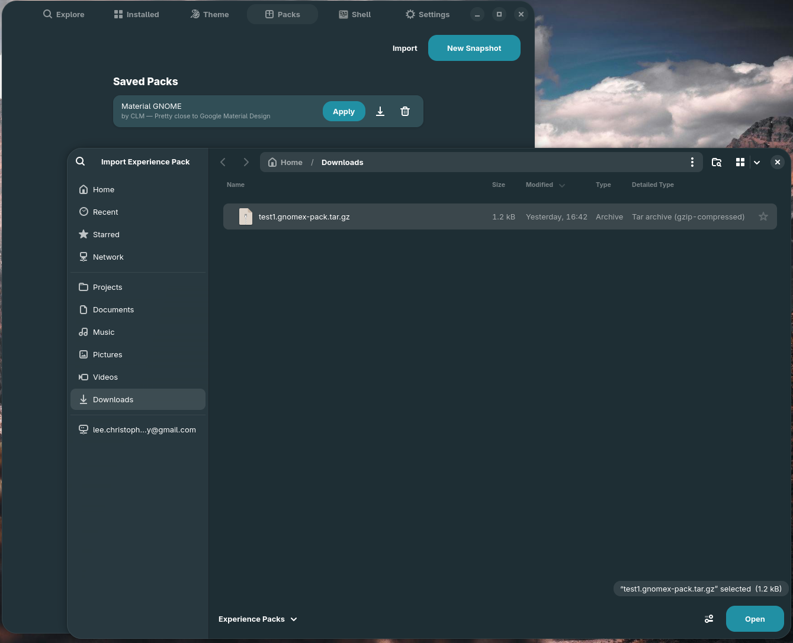
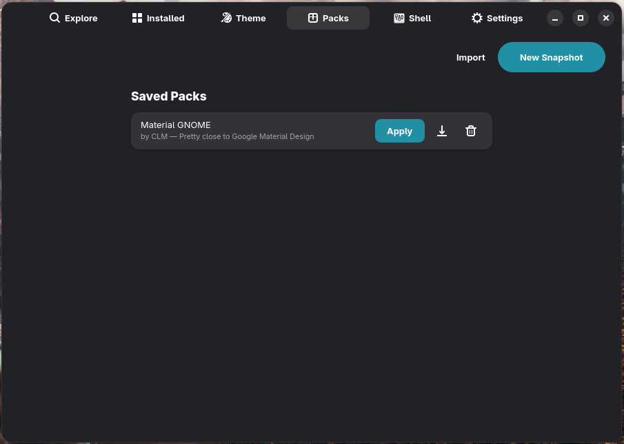
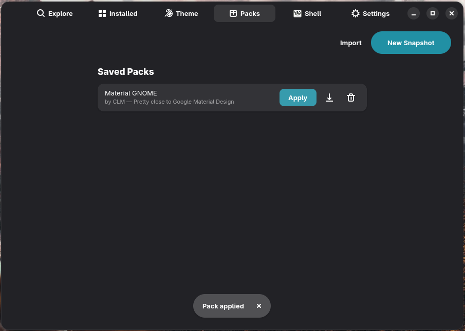

# Tutorial — Apply a pack from someone else

This is the receiving end of [Build a pack](build-a-pack.md). You've been
handed a `.gnomex-pack.tar.gz` file (downloaded, AirDrop'd, scp'd, whatever)
and you want to make your desktop look like the one it captured.

**Time:** 1 minute of clicking, plus however long the downloads take.
**You need:** GNOME X running, a network connection, and the pack file.

## Step 1 — Open the Packs tab

Click **Packs** in the GNOME X header bar. If you've never imported or
created a pack before, you'll see the empty state with the **Snapshot
current desktop** and **Import** buttons.

If you already have packs, the **Import** button is in the toolbar at the
top of the list.

## Step 2 — Click *Import*

A file picker appears. Navigate to the `.gnomex-pack.tar.gz` file you were
given and open it.

GNOME X:

1. Validates the archive (must contain a `pack.toml`)
2. Validates the manifest schema
3. Copies the contents to `~/.local/share/gnome-x/packs/<id>/`
4. Adds a row for the new pack

A toast confirms:

> ✓ Imported *Nordic Elegance*

## Step 3 — Read the detail view

**Don't click Apply yet.** Click the row to open the detail view first. You
should see exactly what's about to happen to your system:

| Section          | What it'll do                                              |
|------------------|------------------------------------------------------------|
| GTK theme        | Download (if missing) and switch to it                     |
| Shell theme      | Download (if missing) and switch to it via User Themes ext |
| Icon pack        | Download (if missing) and switch to it                     |
| Cursor theme     | Download (if missing) and switch to it                     |
| Wallpaper        | Set, if the file path resolves on your machine             |
| Extensions       | For each: install if missing, then enable                  |
| Theme Builder    | Write each `tb-*` key                                      |
| `[[settings]]`   | Write each listed GSettings key                            |

**Why pre-flight matters.** Some packs include extensions you might already
have configured — e.g. **Dash to Dock** with a setup you like. Applying a
pack that lists Dash to Dock as `required = true` will *not* clobber its
configuration (we only enable / disable, we don't write extension settings),
but it will turn the extension on. If you'd rather not enable a particular
optional extension, you can de-select it before applying.

## Step 4 — Click *Apply*

GNOME X works through the manifest top-to-bottom. You'll see a progress
toast for each network step:

> Downloading *Nordic-darker*…
> Downloading *Papirus-Dark*…
> Installing *Blur my Shell*…
> Enabling *User Themes*…
> ✓ Applied **Nordic Elegance**

The whole flow typically takes 10–30 seconds depending on your connection
and how much was already installed.

## Step 5 — See the result

GTK 4 / Libadwaita apps update instantly. GTK 3 apps update on next launch.
Shell-level changes (Shell theme, top-bar position from extensions) need a
**Shell reload**:

- **Wayland**: log out and back in.
- **X11**: <kbd>Alt</kbd>+<kbd>F2</kbd>, type `r`, press <kbd>Enter</kbd>.

If anything didn't take effect, the toast and the activity log
(`journalctl --user -u gnome-x`) will show what failed.

## What just happened

| You did            | GNOME X did                                                    |
|--------------------|----------------------------------------------------------------|
| Clicked **Import** | Validated and copied the archive to the local packs directory  |
| Opened detail view | Re-read the imported `pack.toml`                               |
| Clicked **Apply**  | For each `[theme.*]` / `[icons]` / `[cursor]`: checked if the file already exists locally; if not, downloaded from gnome-look.org's OCS API |
| —                  | For each `[[extensions]]`: called `org.gnome.Shell.Extensions.InstallRemoteExtension` if missing, then `EnableExtension` |
| —                  | Wrote each `tb-*` key to `io.github.gnomex.GnomeX` GSettings   |
| —                  | Wrote each `[[settings]]` key to its named GSettings schema    |
| —                  | Re-rendered Theme Builder CSS so visible changes apply immediately |

## Rolling back

GNOME X **does not** automatically snapshot your previous look before
applying a pack. If you want a return path, snapshot your desktop into a
pack first (call it `before-nordic` or similar), then apply the new one.
You can switch back any time by applying the saved snapshot.

## Troubleshooting

??? failure "Import dialog says 'Invalid pack archive'"

    The file is corrupted or wasn't a valid pack to begin with. Try:

    - `tar -tzf <file>.gnomex-pack.tar.gz` should list `pack.toml` at minimum.
    - If `pack.toml` is missing, the file isn't a pack archive.
    - If it's present but the import still fails, the manifest may be using
      an unsupported `pack_format` version. Check the
      [Pack TOML reference](../reference/pack-toml.md) for currently-supported
      formats.

??? failure "Apply succeeds but the theme doesn't look right"

    Open the **Customize** tab — is the GTK theme dropdown showing the right
    name? If yes, the theme is applied but visually different on your machine
    than on the original — usually because of accent colour or Theme Builder
    differences that the pack didn't capture (older packs predate the Theme
    Builder section). Re-snapshot from the original desktop with current
    GNOME X to capture every value.

??? failure "An extension failed to install"

    Most common cause: the extension's metadata says it isn't compatible
    with your Shell version. Open **Settings** → **Disable extension version
    validation**, then re-apply. The extension itself may not work as
    expected on your version, but it will install.

??? failure "The wallpaper didn't change"

    Wallpapers are referenced by path. If the pack's wallpaper path doesn't
    resolve on your machine, the rest of the pack still applies but the
    wallpaper step is silently skipped. Check the toast log — if it didn't
    say "Wallpaper applied", the path is missing on your end.

## Where to go next

- [Build your own Experience Pack](build-a-pack.md) — once you have a look
  you like, snapshot it.
- [Pack TOML reference](../reference/pack-toml.md) — to write or edit packs
  by hand.
