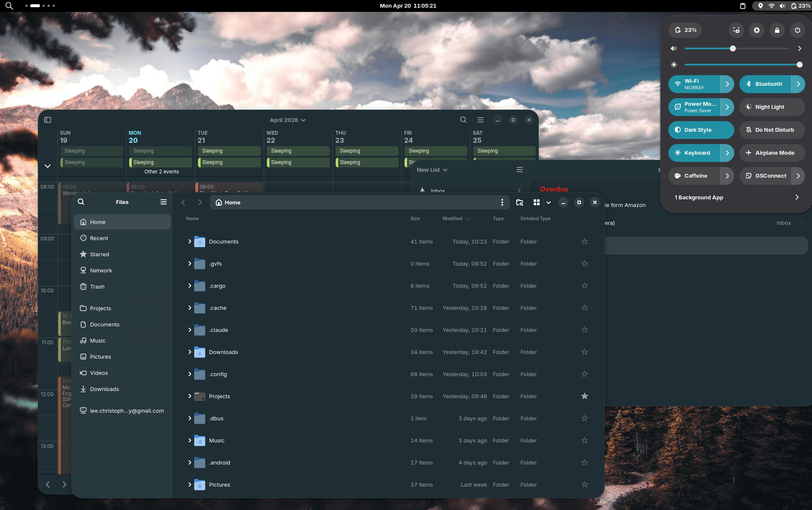
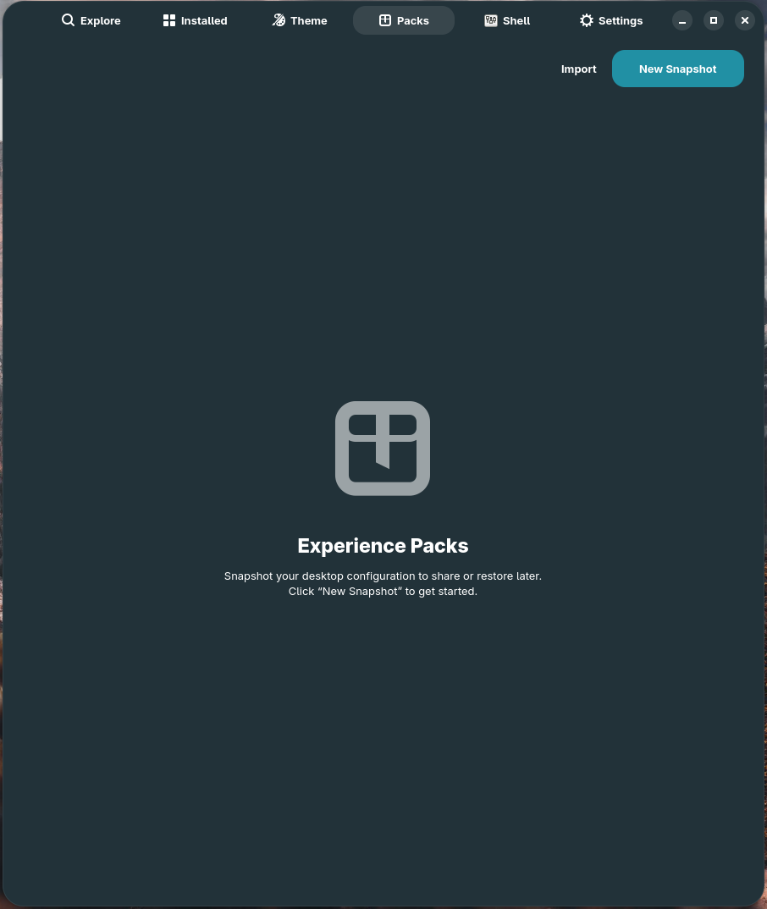
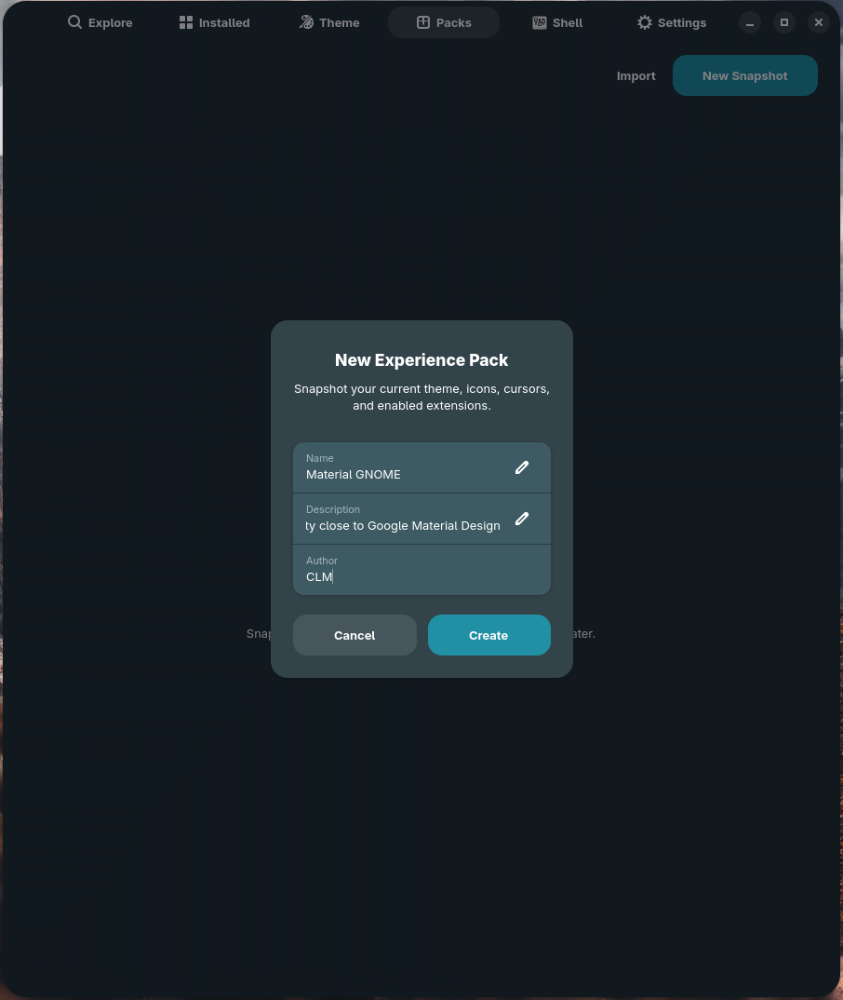
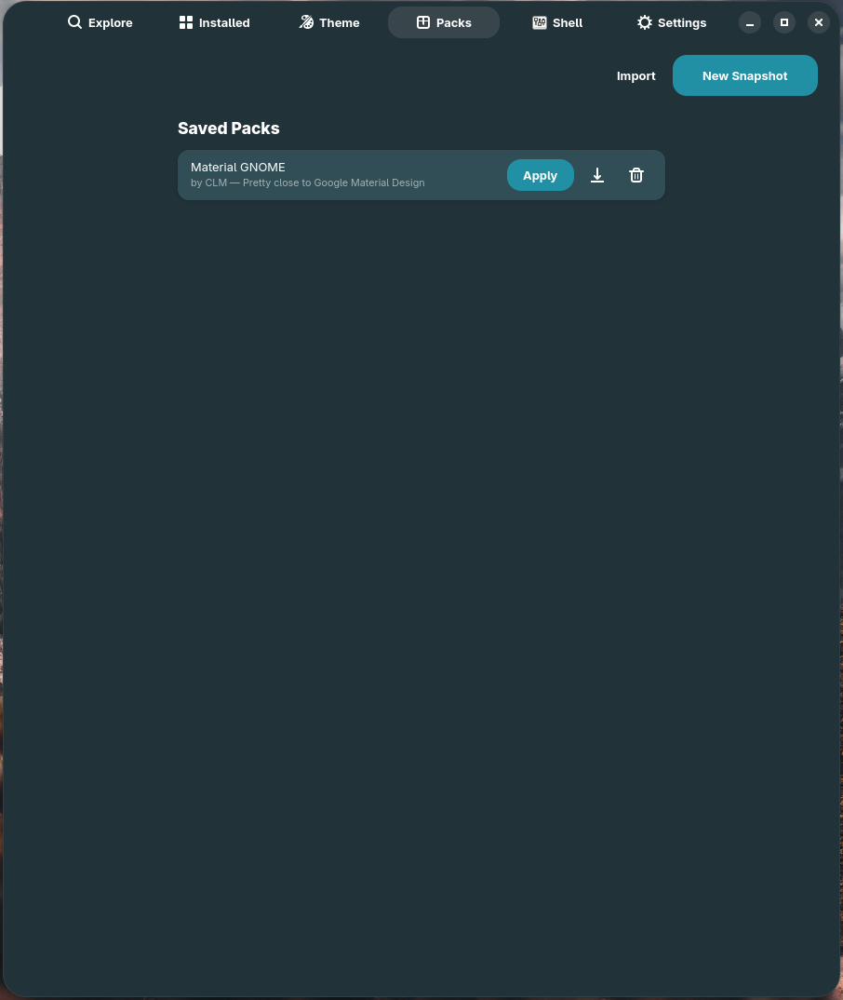

# Tutorial — Build your first Experience Pack

An **Experience Pack** is a single `.gnomex-pack.tar.gz` file that captures
your entire desktop look — theme, icons, cursor, wallpaper, enabled
extensions, Theme Builder values — into a portable manifest. This tutorial
walks you through making one from your current setup, exporting it, and
keeping it organised.

**Time:** 5 minutes.
**You need:** a desktop you've spent some time customizing (extensions
enabled, theme picked, etc.), and somewhere to save the file.

## Step 1 — Get your desktop into the state you want

Before snapshotting, do whatever customization you'd want to reproduce on a
fresh machine:

- Pick a GTK theme, icon pack, and cursor in the **Customize** tab
- Enable / disable the extensions you want in the **Installed** tab
- Set your wallpaper in **GNOME Settings**
  (GNOME X reads it from GSettings, so any tool works)
- Tweak Theme Builder values (radius, panel opacity, accent intensity, etc.)
  to taste

There's no need to be cautious — you can keep iterating after the snapshot
and re-snapshot at any time.



## Step 2 — Open the Packs tab

Click the **Packs** tab in the GNOME X header bar. If you've never made a
pack before, the page shows an empty state with two prominent buttons:

- **Snapshot current desktop** — captures your live state
- **Import** — loads a pack someone else has shared



## Step 3 — Click *Snapshot current desktop*

A dialog appears asking for:

| Field         | What it's for                                                  |
|---------------|----------------------------------------------------------------|
| **ID**        | A short, unique slug. Used as the filename and as the pack key. Use kebab-case (`nordic-elegance`, `oled-minimal`). |
| **Name**      | The display name. Free-form.                                   |
| **Author**    | Your name or handle.                                           |
| **Description** | One or two sentences about what the look is going for.       |
| **Screenshot** | Optional. Pick the image you took in Step 1, or leave empty. |

GNOME X reads the rest from your live system: GTK theme, Shell theme, icon
pack, cursor, wallpaper path, enabled extensions (with their UUIDs and
display names), and your Theme Builder values.



Click **Save**. The new pack appears as a row in the Packs tab.

## Step 4 — Inspect what was captured

Each pack row shows:

- The pack's screenshot (or a placeholder if you skipped it)
- Name, description, author, creation date, target Shell version
- A row of action buttons: **Apply**, **Export**, **Edit metadata**, **Delete**

Click the row to open the detail view, which lists every captured item:

- The exact GTK theme, Shell theme, icon pack, cursor with their
  gnome-look.org content / file IDs
- Every enabled extension with its UUID and a `required` flag (we mark all
  captured extensions as required by default; you can toggle this in **Edit
  metadata**)
- Every Theme Builder value
- Optional `[[settings]]` overrides for arbitrary GSettings keys



## Step 5 — Export it

Click the **Export** button on the pack row (or in the detail view). GNOME X
opens a save dialog defaulting to `<id>.gnomex-pack.tar.gz`. Pick a location
and click **Save**.

The archive contains:

```
<id>.gnomex-pack.tar.gz
├── pack.toml          # the manifest
└── screenshot.webp    # optional cover image
```

The TOML manifest looks like
[the sample in CONTEXT/sample-nordic-elegance.gnomex-pack.toml][sample] —
see [the Pack TOML reference](../reference/pack-toml.md) for the full
schema.

[sample]: https://github.com/leechristophermurray/gnome-x/blob/main/CONTEXT/sample-nordic-elegance.gnomex-pack.toml

You can now hand this file to anyone — they import it, click **Apply**, and
their desktop becomes yours (assuming network access to gnome-look.org and
extensions.gnome.org). See
[Apply someone else's pack](apply-a-pack.md).

## Where the pack lives

Saved packs are persisted at
`~/.local/share/gnome-x/packs/<id>/`:

```
~/.local/share/gnome-x/packs/
└── nordic-elegance/
    ├── pack.toml
    └── screenshot.webp
```

You can edit `pack.toml` by hand if you want to change a field — GNOME X
re-reads the file every time the Packs tab opens. Schema is
[here](../reference/pack-toml.md).

## What just happened

| You did                    | GNOME X did                                                |
|----------------------------|------------------------------------------------------------|
| Clicked **Snapshot**       | Read GTK theme / icon / cursor names from `org.gnome.desktop.interface` |
| —                          | Read wallpaper from `org.gnome.desktop.background`         |
| —                          | Asked GNOME Shell over D-Bus for the list of enabled extensions, with metadata |
| —                          | Read all `tb-*` Theme Builder keys from `io.github.gnomex.GnomeX` |
| —                          | Wrote `pack.toml` and copied the screenshot to `~/.local/share/gnome-x/packs/<id>/` |
| Clicked **Export**         | Tar+gzipped that directory into the location you chose     |

## Editing a pack after the fact

Two paths:

=== "Through the UI"

    Click **Edit metadata** on the pack row. You can change:

    - Name, description, author
    - Mark / unmark individual extensions as required
    - Replace the screenshot

    The captured theme / icons / cursor / Shell version aren't editable
    through the UI — to change those, re-snapshot from your current desktop.

=== "By editing pack.toml"

    Open `~/.local/share/gnome-x/packs/<id>/pack.toml` in any editor. Add,
    remove, or change any field — see the
    [Pack TOML reference](../reference/pack-toml.md) for the full schema.
    Reopen the Packs tab and your edits are reflected.

## Troubleshooting

??? failure "The Snapshot button is greyed out"

    GNOME X requires a working D-Bus connection to `org.gnome.Shell.Extensions`
    to enumerate enabled extensions. Run `experiencectl status` — if
    `Shell version:` is blank, you're in a non-GNOME session and snapshotting
    is disabled.

??? failure "I exported a pack but my friend can't apply it"

    Most likely cause: the pack references a gnome-look.org file by ID, and
    that file was updated by its author since you snapshotted. The new
    `file_id` differs from the one in your `pack.toml`. Re-snapshot to pick
    up the new ID, or edit the pack TOML manually.

??? failure "My wallpaper didn't get bundled"

    Wallpapers are referenced by **path** (`file:///...`), not bundled. The
    path is recorded in the `[pack]` table's `wallpaper` field. If your
    friend doesn't have a file at that path, the wallpaper step fails
    gracefully — everything else still applies. To distribute a wallpaper
    too, host it somewhere and edit the pack TOML to point at the URL
    (we resolve `https://` paths the same as `file://`).

## Where to go next

- [Apply someone else's pack](apply-a-pack.md) — see the receiving end of
  this flow.
- [Pack TOML reference](../reference/pack-toml.md) — every field, every type.
- [Override colours for individual widgets](widget-colors.md) — tune the
  Theme Builder before snapshotting.
