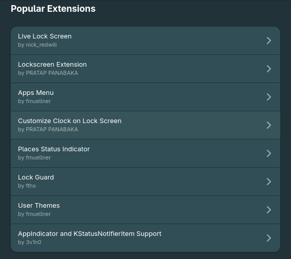
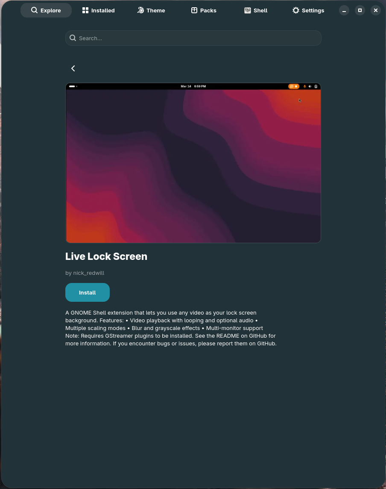
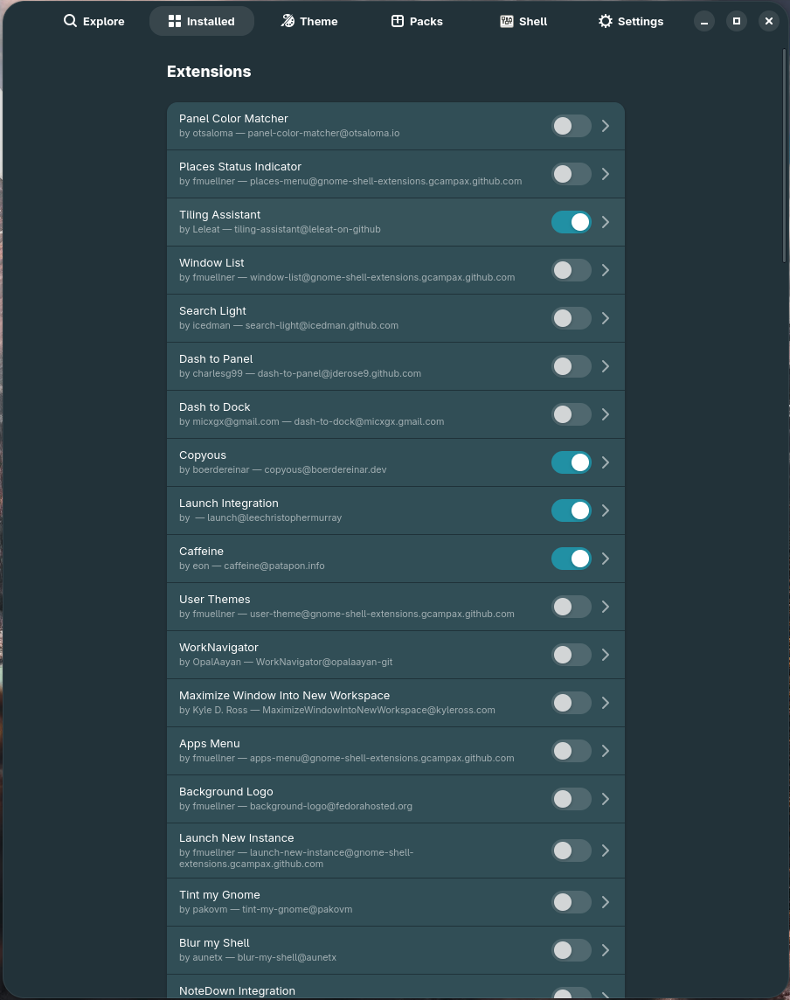

# Tutorial — Install your first extension

This is the shortest tutorial in the set. It walks you through finding a GNOME
Shell extension, installing it, and switching it on. By the end you'll know
where in GNOME X each piece lives.

**Time:** about 2 minutes.
**You need:** GNOME X running, a working network connection, GNOME Shell 45+.

## 1. Open Explore

Launch GNOME X. The **Explore** tab is selected by default.

## 2. Find an extension

You can either scroll the **Popular extensions** row, or use the search field
at the top of the Explore tab. Search is case-insensitive and matches against
extension name and description. Try `clipboard` to find a clipboard manager.

!!! tip "What you'll see"
    Each tile shows the extension name, author, and a compatibility badge:

    - **Compatible** — the upstream metadata says this extension supports your
      Shell version.
    - **Unverified** — the extension exists but hasn't been marked compatible
      with your Shell version. You can still install it if you've enabled
      **Disable extension version validation** in
      [Settings](../first-run.md#what-gnome-x-needs-from-your-system).

## 3. Open the detail view

Click the tile. A full-screen detail page slides in:

- Screenshot at the top
- Description, author, license, last-updated date
- An **Install** button on the right

## 4. Click Install

GNOME X downloads the extension's zip from extensions.gnome.org and hands it
to GNOME Shell's standard install pipeline over D-Bus. You'll see GNOME's
**native** confirmation dialog — this is enforced by GNOME Shell, not GNOME X,
and exists so users can't be tricked into installing extensions silently.

Click **Install**. The detail page returns to the Explore view and a toast
appears at the bottom of the window:

> ✓ Installed *Blur my Shell*

## 5. Enable it

Switch to the **Installed** tab. Your new extension is at the top of the list
with its switch in the **Off** position. Flip it on.

That's it. The extension is live in your current session. Some extensions
require a Shell reload to take full effect — on Wayland this means signing
out; on X11 you can press <kbd>Alt</kbd>+<kbd>F2</kbd>, type `r`, and press
<kbd>Enter</kbd>.

## What just happened

| You did       | GNOME X did                                              |
|---------------|----------------------------------------------------------|
| Searched      | Hit `extensions.gnome.org/extension-query/`              |
| Opened detail | Fetched extension metadata + screenshot                  |
| Clicked Install | Downloaded zip, called `org.gnome.Shell.Extensions.InstallRemoteExtension` over D-Bus |
| Flipped switch  | Called `org.gnome.Shell.Extensions.EnableExtension`     |

GNOME X is a thin, polished surface over the same APIs Settings and
`gnome-extensions(1)` already use. If something goes wrong, the same fixes
apply.

## Troubleshooting

??? failure "The Install button is greyed out"

    The extension's metadata says it isn't compatible with your Shell version.
    Either pick a compatible version, or open the **Settings** tab and enable
    **Disable extension version validation**, then try again. Be aware that
    incompatible extensions may misbehave or refuse to load.

??? failure "Nothing happens after I click Install"

    Open a terminal and run `experiencectl status`. If `Shell version:` is
    blank, GNOME X cannot reach the GNOME Shell D-Bus interface — usually
    because you're in a non-GNOME session. Extension management requires a
    GNOME Shell session.

??? failure "The toast says ✓ but the extension isn't in the list"

    Click the **Installed** tab header to refresh. If it's still missing, the
    extension may have failed to extract — check
    `~/.local/share/gnome-shell/extensions/` for the UUID directory.

## Where to go next

- [Install a theme from gnome-look.org](themes.md) — same tab, different content type.
- [Snapshot your desktop into an Experience Pack](build-a-pack.md) — once
  you've installed a few extensions you'll want to capture them.
