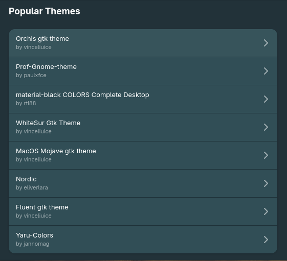
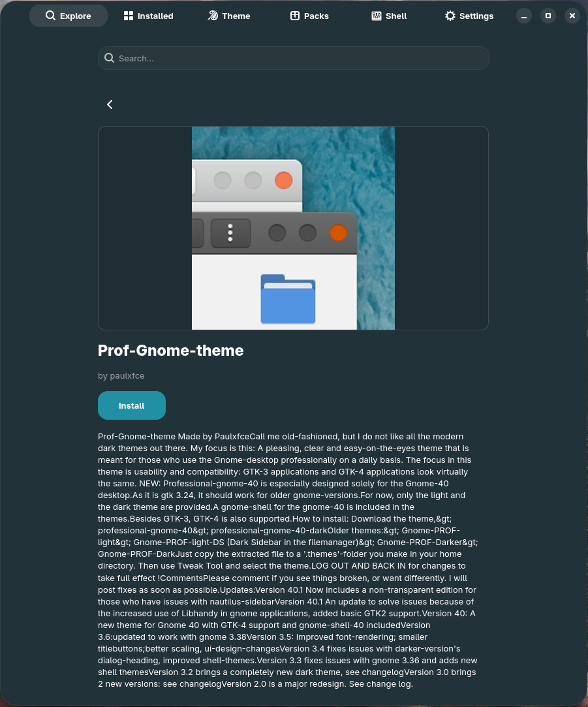
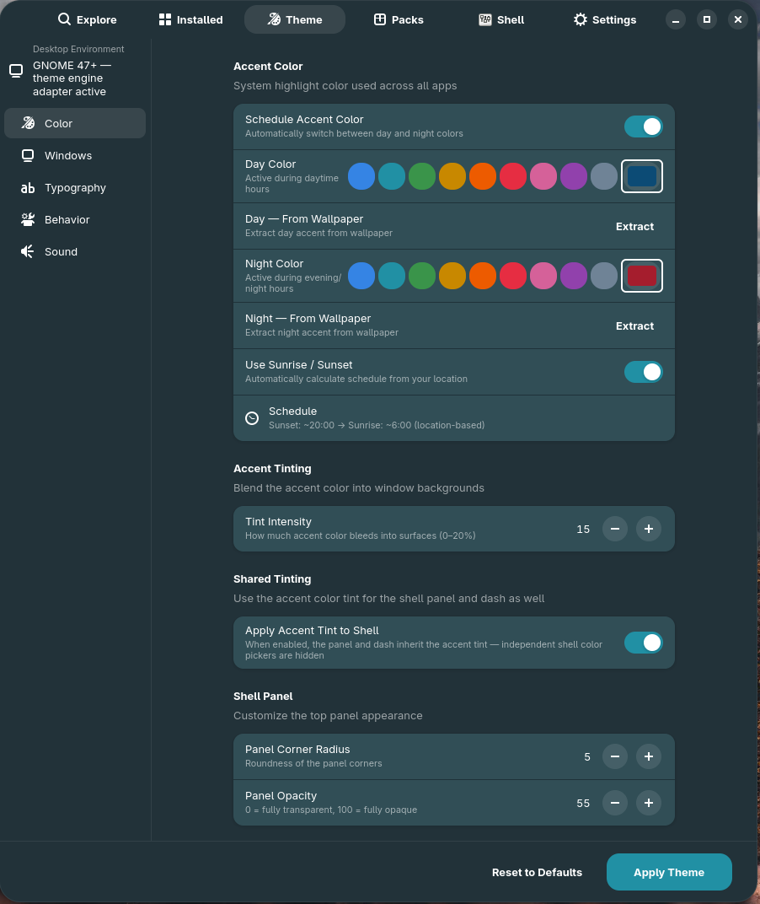

# Tutorial — Install a theme from gnome-look.org

GNOME X talks to the **gnome-look.org OCS API** the same way it talks to
extensions.gnome.org, so themes, icon packs, and cursor themes all install
through the same flow as extensions. This tutorial walks you through a GTK
theme, then points out the spots where icons and cursors differ.

**Time:** 3 minutes per item.
**You need:** GNOME X running, a working network connection.

## 1. Open Explore and pick a category

The Explore tab has rows for each content type:

- GNOME Shell extensions
- **GTK themes**
- Shell themes
- Icon packs
- Cursor themes

Scroll to **GTK themes** (or use the **Customize** tab's GTK theme search if
you already know what you want).

## 2. Find a theme

Use the search field at the top of the Explore tab. Names work
(`Nordic`, `Adw-gtk3`, `Materia`), and so do partial keywords (`dark`,
`oled`). Each tile shows the theme name, author, and the gnome-look.org
download count.

!!! tip "If you're new to picking themes"
    Three safe, popular GTK themes that look good with stock GNOME:

    - **`adw-gtk3`** — makes GTK 3 apps look like Libadwaita ones.
    - **`Nordic`** — cool, low-contrast, easy on the eyes.
    - **`Catppuccin-*`** — pastel palette, four flavours, a very large
      following.

## 3. Open the detail view

Click the tile. The detail page shows screenshots, the description, and an
**Install** button. Larger themes can take a few seconds to fetch — there's
a spinner inside the button while the download is in progress.

## 4. Click Install

GNOME X downloads the theme archive from gnome-look.org and extracts it to
`~/.local/share/themes/<Name>/`. A toast confirms the install:

> ✓ Installed *Nordic*

The theme is now visible to GTK and Libadwaita, but **not yet active**.

## 5. Apply it

Switch to the **Customize** tab. Scroll to the **GTK theme** dropdown. The
just-installed theme appears in the list. Pick it.

GNOME X writes the theme name to the
`org.gnome.desktop.interface gtk-theme` GSettings key. GTK 4 and Libadwaita
apps reload automatically; GTK 3 apps pick up the change on next launch.

!!! warning "GNOME 47+ and gtk-theme"
    Modern GNOME doesn't honour `gtk-theme` for native Libadwaita apps — the
    Adwaita stylesheet is fixed by design, and the accent colour is the only
    knob the upstream HIG exposes. GNOME X applies the theme to GTK 3 apps
    and to non-Adwaita GTK 4 apps. To customize the look of Adwaita apps, use
    the **Theme Builder** section of the Customize tab — see
    [the per-widget colour overrides tutorial](widget-colors.md).

## Icon packs and cursor themes

The flow is identical, with one wrinkle each:

=== "Icon packs"

    Same Install button, same `~/.local/share/icons/<Name>/` destination,
    same Customize-tab dropdown.

    AppImages and a small set of apps that ship icons directly into the
    `hicolor` theme will **win** over your icon pack — see
    [Known limitations → AppImage icon overrides](../known-limitations.md#appimage-icon-overrides)
    for the why and the workarounds.

=== "Cursor themes"

    Same flow, written to
    `~/.local/share/icons/<Name>/cursors/`. The change is applied via
    `org.gnome.desktop.interface cursor-theme`. Some apps cache the cursor
    image at startup; you may need to log out and back in to see the new
    cursor everywhere.

## What just happened

| You did            | GNOME X did                                                       |
|--------------------|-------------------------------------------------------------------|
| Searched           | Hit gnome-look.org's OCS endpoint with the category filter        |
| Opened detail      | Fetched the OCS content metadata and screenshots                  |
| Clicked Install    | Downloaded the archive, extracted it under `~/.local/share/`      |
| Picked it from the dropdown | Wrote the chosen name to the relevant GSettings key      |

## Troubleshooting

??? failure "Theme installed, but it doesn't appear in the dropdown"

    GNOME X populates the dropdown by scanning `~/.local/share/themes/` for
    directories containing a `gtk-3.0/` or `gtk-4.0/` subdirectory. Some
    older themes ship only a `metacity-1/` (window decorations) and no GTK
    files — those will install but won't show up. Check the directory; if
    no `gtk-*/` is present, that theme isn't a full GTK theme.

??? failure "The download fails or times out"

    gnome-look.org occasionally rate-limits unauthenticated downloads. Wait a
    minute and retry. If the failure repeats, the file ID may be stale —
    open the gnome-look.org page in a browser to confirm the file still exists.

??? failure "Apps look wrong after applying the theme"

    Some themes target a specific GTK version and break on others. Switch
    back to **Adwaita** in the dropdown, then try a different theme. To
    fully reset GTK overrides, see
    [GSettings → Resetting everything](../reference/gsettings.md#resetting-everything).

## Where to go next

- [Snapshot your desktop into an Experience Pack](build-a-pack.md) — capture
  this whole look in a TOML file.
- [Override colours for individual widgets](widget-colors.md) — tweak the
  Adwaita palette beyond what the dropdown allows.
