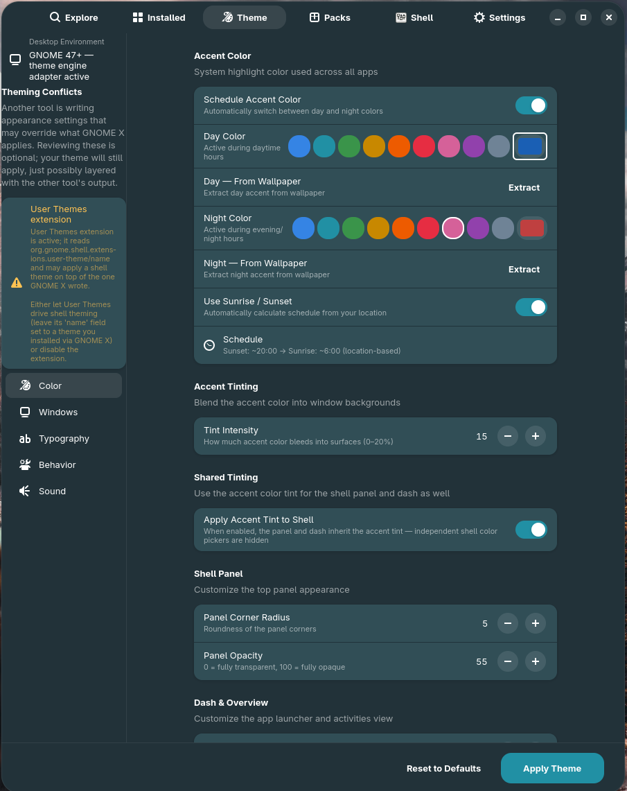
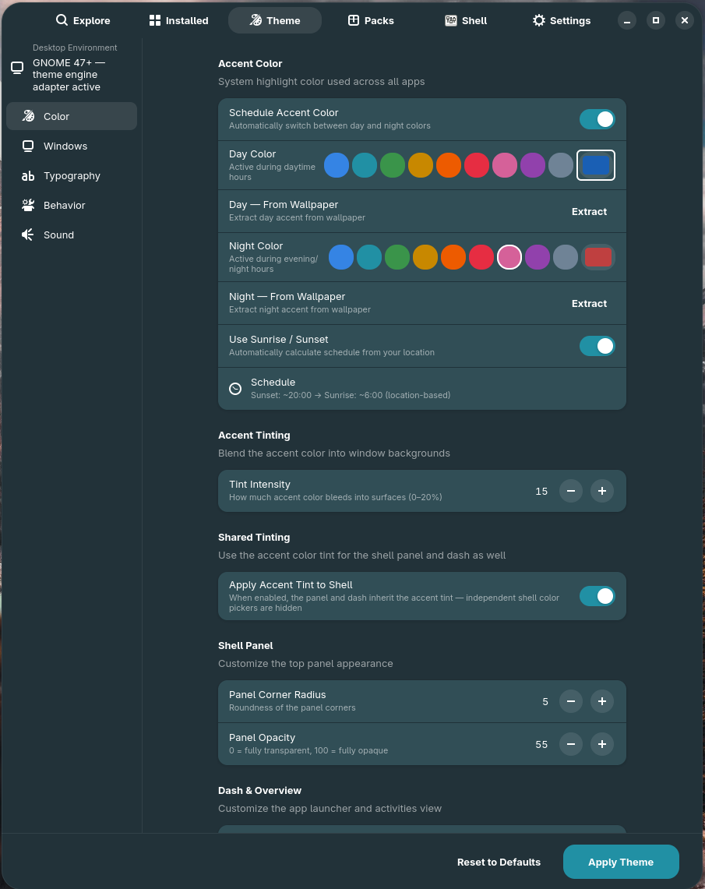

# Tutorial — Detect and resolve theming conflicts

GNOME X is one tool among many that can write appearance settings. **User
Themes**, **Blur My Shell**, **Dash to Dock**, **Night Theme Switcher**,
**GNOME Tweaks**, and a hand-edited `~/.config/gtk-4.0/gtk.css` can all
silently override what GNOME X applies. The result: you change a setting,
nothing visible happens, and you don't know why.

The **Theming Conflicts** panel makes the invisible visible. This tutorial
walks through what each detected conflict means and how to resolve it.

**Time:** depends on how many conflicts you have.
**You need:** GNOME X **0.2.0 or later** (conflict detection landed in
[`ef3eb40`][commit]).

[commit]: https://github.com/leechristophermurray/gnome-x/commit/ef3eb40

## Where it lives

Open the **Customize** tab. Scroll to the top of the Theme Builder section.
If GNOME X has detected anything, a **Theming Conflicts** group sits there
with a yellow / warning-style banner row for each detection.

If you don't see the group, you have no detected conflicts — congratulations.



## What it can detect

GNOME X scans for **seven** specific conflict sources at startup. Each is
*advisory* — your theme will still apply; the panel just tells you that
something else is layered on top.

### 1. User Themes extension

**What it is.** The `user-theme@gnome-shell-extensions.gcampax.github.com`
extension lets you pick a custom Shell theme. It reads
`org.gnome.shell.extensions.user-theme name`.

**Why it conflicts.** GNOME X also writes Shell themes (when applying an
Experience Pack), but User Themes can pick a different one and that wins
for the live Shell session.

**Resolution.**

- If you applied a pack that included a Shell theme, **let User Themes
  manage it** — the pack already wrote the right name to the User Themes
  GSetting, and that's the path GNOME Shell actually reads.
- If you didn't apply a pack but User Themes has a theme set, GNOME X
  flags it so you know which theme is *actually* visible. Open
  Extensions → User Themes settings to see and change it.

### 2. Blur My Shell

**What it is.** A popular extension that applies blur to the panel,
overview, dash, and other Shell surfaces.

**Why it conflicts.** GNOME X paints the panel with an accent-tinted
background (controlled by the **Tint Intensity** slider). Blur My Shell
paints over that with its own blur layer, so your tint colour is what
shows *behind* the blur — not the surface visible to the user.

**Resolution.**

- **Keep both** if you like the blur — adjust your tint to be more
  saturated to compensate for the desaturation the blur introduces.
- **Disable Blur My Shell's panel blur** in Extensions → Blur My Shell →
  Panel if you want GNOME X's tint to show directly.
- GNOME X has a `tb-overview-blur` GSetting of its own (Customize → Theme
  Builder → Overview Background Blur). If you turn that on, you don't
  need Blur My Shell for that specific surface.

### 3. Dash to Dock

**What it is.** Replaces the GNOME overview's dash with its own dock
widget tree.

**Why it conflicts.** Our `#dash` CSS selector targets the stock dash
widget; Dash to Dock's widget has a different ID, so the **Dash Opacity**
slider in Theme Builder has no visible effect when Dash to Dock is enabled.

**Resolution.**

- Configure Dash to Dock's opacity / colour in **Extensions → Dash to
  Dock → Appearance** instead of using GNOME X's dash slider.
- Or disable Dash to Dock if you prefer the stock overview.

### 4. Dash to Panel

**What it is.** Even more aggressive — replaces the panel *and* the dash
with a unified taskbar.

**Why it conflicts.** Both the **Panel Opacity** and **Tint Intensity**
sliders target the stock GNOME panel widget tree, which Dash to Panel has
removed. Neither slider does anything visible while Dash to Panel is
enabled.

**Resolution.**

- Tune appearance in **Extensions → Dash to Panel → Style** instead.
- Or disable Dash to Panel.

### 5. Night Theme Switcher

**What it is.** An extension that flips
`org.gnome.desktop.interface color-scheme` between `default` and
`prefer-dark` on a schedule.

**Why it conflicts.** If you set GNOME X's colour scheme manually, Night
Theme Switcher will flip it back at the next scheduled tick. Looks like
GNOME X "didn't save" your setting.

**Resolution.**

- GNOME X has its own scheduled-accent feature (Customize → Schedule
  Accent Color) that's compatible with Night Theme Switcher's colour-scheme
  flips. If you want both, fine — they target different keys.
- If you only want GNOME X to manage scheduling, disable Night Theme
  Switcher.

### 6. Legacy `gtk-theme` GSetting

**What it is.** Older versions of GNOME Tweaks (and some scripts) wrote
`org.gnome.desktop.interface gtk-theme` to a non-default value. Modern
GNOME has deprecated this — but the value persists in GSettings until
explicitly cleared.

**Why it conflicts.** GTK 3 apps (and a small set of legacy GTK 4 apps)
still honour this setting and will load the named theme regardless of what
the GNOME X Customize tab shows.

**Resolution.**

```sh
# Reset the legacy key to GNOME's default
gsettings reset org.gnome.desktop.interface gtk-theme
```

Then restart any open GTK 3 apps. The conflict row will disappear next
time you open Customize.

### 7. Unmanaged `~/.config/gtk-4.0/gtk.css`

**What it is.** A `gtk.css` file in your config directory that GNOME X
**did not** write — i.e. the file is missing GNOME X's managed-region
markers.

**Why it conflicts.** GTK 4 always loads `~/.config/gtk-4.0/gtk.css`. If
you've hand-edited it (or installed a theme that put one there), every
selector in that file overrides what GNOME X writes for the same selector.

**Resolution.** Three options:

=== "Keep your hand-edited CSS"

    Your hand edits will keep winning. GNOME X's Theme Builder values are
    silently shadowed for any selector you've defined. This is fine if you
    know what you're doing.

=== "Let GNOME X manage it"

    Move your custom CSS aside and let GNOME X own the file:

    ```sh
    mv ~/.config/gtk-4.0/gtk.css ~/.config/gtk-4.0/gtk.css.bak
    ```

    Then in GNOME X, change any Theme Builder slider — the file is
    rewritten with GNOME X's managed markers.

=== "Merge them"

    Open `~/.config/gtk-4.0/gtk.css.bak`, copy the rules you want to keep,
    and paste them into `~/.config/gtk-4.0/gtk.css` *outside* the
    `/* GNOME X managed begin */` … `/* GNOME X managed end */` block.
    GNOME X only rewrites within the managed block; everything outside is
    preserved across regeneration.

## Step-by-step: working through a conflict list

1. Open **Customize** in GNOME X.
2. If a **Theming Conflicts** group is at the top, expand each row and read
   the `description` (what it does) and the `recommendation` (what to do).
3. Resolve them one at a time. The most-impactful resolutions, in order:
   1. Fix legacy `gtk-theme` (one shell command, immediate effect).
   2. Reconcile the hand-edited `gtk.css` (your call which approach).
   3. Decide whether to keep dash/panel replacements — they're a
      design choice, not a bug.
4. Close and reopen the Customize tab. Resolved conflicts disappear from
   the list.



## Why this is advisory, not an error

Most "conflicts" are intentional choices. Running Blur My Shell alongside a
GNOME X tint is a common, legitimate setup — the user wants both. Forcing
the user to disable one would be paternalistic and wrong.

The point of the panel is **transparency**: when you change a slider and
nothing happens, you can immediately see *why* without spending an
afternoon bisecting your extensions.

## What just happened (under the hood)

| Detection                  | How it's detected                                                  |
|----------------------------|--------------------------------------------------------------------|
| User Themes extension      | Read `org.gnome.shell.extensions.user-theme name` — non-empty fires the conflict |
| Blur My Shell              | Check the enabled-extensions list for `blur-my-shell@aunetx`       |
| Dash to Dock               | Check for `dash-to-dock@micxgx.gmail.com`                          |
| Dash to Panel              | Check for `dash-to-panel@jderose9.github.com`                      |
| Night Theme Switcher       | Check for `nightthemeswitcher@romainvigier.fr`                     |
| Legacy gtk-theme           | Read `org.gnome.desktop.interface gtk-theme` — non-default value fires the conflict |
| Unmanaged gtk.css          | Read `~/.config/gtk-4.0/gtk.css` — no managed-region marker fires the conflict |

All seven scans run **once at Customize-tab init** and don't poll. To
re-scan after fixing something, close and reopen the Customize tab.

## Where to go next

- [Per-widget colour overrides](widget-colors.md) — once conflicts are
  resolved, your overrides will actually take effect.
- [Known limitations](../known-limitations.md) — for the conflicts that
  *aren't* fixable in GNOME X (Chromium theming, AppImage icons, GDM).
