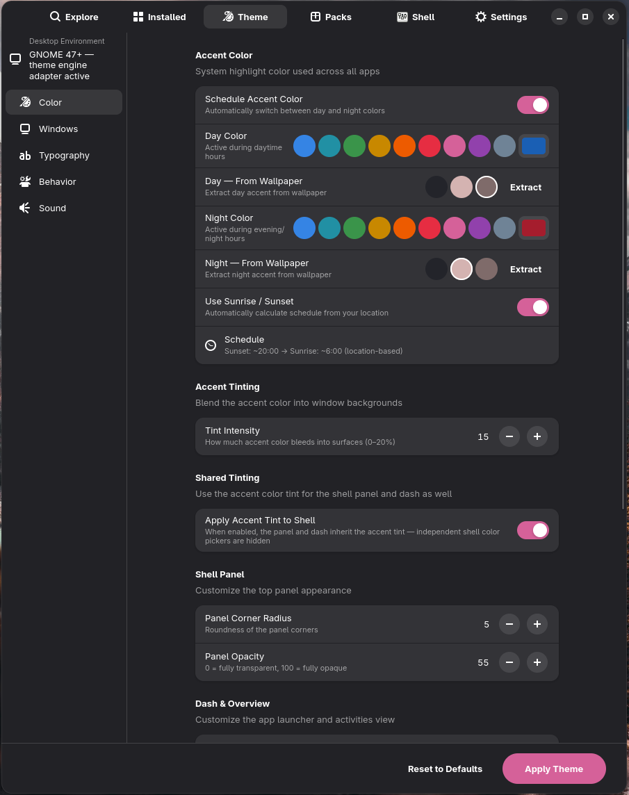

# Tutorial — Per-widget, per-scheme colour overrides

Adwaita's accent colour controls a *lot* — but it doesn't let you say
"buttons in dark mode should be slightly warmer than the headerbar". The
**Widget Colours** panel in GNOME X does. This tutorial covers what each
slot does, when to use it, and how the light/dark independence works.

**Time:** as long as you want to spend picking colours.
**You need:** GNOME X **0.2.0 or later** (the Widget Colours panel was added
in [`8068e02`][commit]).

[commit]: https://github.com/leechristophermurray/gnome-x/commit/8068e02

## What it does

The Widget Colours panel exposes four GTK 4 / Libadwaita CSS variables for
direct override:

| Slot                 | CSS variable          | What it colours                                        |
|----------------------|-----------------------|--------------------------------------------------------|
| Button Background    | `@button_bg_color`    | Default, non-suggested, non-flat buttons everywhere.   |
| Input Background     | `@entry_bg_color`     | `GtkEntry`, `AdwEntryRow`, search fields, comboboxes.  |
| Headerbar Background | `@headerbar_bg_color` | Every native window's titlebar / headerbar fill.       |
| Sidebar Background   | `@sidebar_bg_color`   | The sidebar panel in `AdwNavigationSplitView`-style apps. |

Each slot has **two colour pickers** — one for light mode, one for dark mode —
because what looks good against `#fafafa` rarely looks good against `#1e1e1e`.
They're stored independently and applied based on the active GNOME colour
scheme.

A **reset** button per row clears both overrides at once and falls back to the
Adwaita / accent-tint default.

## Step 1 — Open Customize → Widget Colours

In GNOME X, click **Customize**, scroll to the **Widget Colours** group.



Each row has three controls on the right:

```
[ Light picker ] [ Dark picker ] [ ⌫ Reset ]
```

Hover the pickers — the tooltip says "Light mode" or "Dark mode".

## Step 2 — Pick a colour

Click the **light** picker on any row. GNOME's standard colour-chooser
dialog opens. Pick a colour, click **Select**.

Two things happen:

1. The Theme Builder writes the hex value to the corresponding GSettings
   key (e.g. `tb-color-button-bg-light = "#ff8a3d"`).
2. GNOME X regenerates `~/.config/gtk-4.0/gtk.css` and
   `~/.config/gtk-3.0/gtk.css` with the new override block.

GTK 4 and Libadwaita apps **reload immediately** — open Files / Nautilus and
watch the buttons change without restarting the app.

## Step 3 — Pick the dark counterpart

Click the **dark** picker on the same row. Pick a darker, more saturated
version of the same hue (or something completely different — there are no
rules).

If you're currently in light mode, you won't see the dark choice take effect
until you switch the GNOME colour scheme. Open **GNOME Settings → Appearance**
or use the GNOME X **Customize → Style** dropdown to flip.


## Step 4 — Reset what you don't want

Click the **⌫ Reset** button on a row to clear both light and dark overrides
at once. The slot reverts to whatever Adwaita ships, modulated by your
accent colour and tint intensity.

## How it interacts with everything else

| Setting                        | Relationship to widget colours                                    |
|--------------------------------|-------------------------------------------------------------------|
| Accent colour                  | The Widget Colour overrides **win** over the accent tint per slot. |
| Tint intensity                 | Slots with no override still tint with accent intensity. Overridden slots ignore tint intensity. |
| Window radius / element radius | Independent. Widget Colours don't change shape, only fill.        |
| GTK theme dropdown             | If you select a non-Adwaita theme, the override block is still emitted but the theme may shadow it. Adwaita-friendly themes (e.g. `adw-gtk3`) cooperate; aggressively re-skinned themes (Materia, Catppuccin overlays) may not. |

## When to use each slot

??? tip "Button Background"

    The single most visible change you can make. Use it when you want
    buttons to be a different temperature from the surrounding chrome —
    e.g. a warm cream button on a cool grey window.

??? tip "Input Background"

    Useful for **OLED-friendly** themes — set Input Background to pure black
    (`#000000`) in dark mode and inputs become indistinguishable from the
    panel, recovering the rest-state-pixel-off OLED look without
    flat-flattening the rest of the chrome.

??? tip "Headerbar Background"

    Lets you create **app-chrome / content separation** without breaking
    Adwaita's flat philosophy elsewhere. Pick a slightly darker headerbar
    in dark mode for a subtle layered look.

??? tip "Sidebar Background"

    Pairs well with Headerbar Background for `AdwNavigationSplitView` apps
    (Files, Settings, Calendar). Picking a colder sidebar against a warmer
    main pane gives the eye an anchor for the navigation rail.

## What just happened (under the hood)

| You did                | GNOME X did                                                         |
|------------------------|---------------------------------------------------------------------|
| Picked a colour        | Wrote the hex to `tb-color-<slot>-<scheme>` in `io.github.gnomex.GnomeX` |
| —                      | Re-ran the Theme CSS generator (`crates/infra/src/theme_css/`)      |
| —                      | Wrote `~/.config/gtk-4.0/gtk.css` and `~/.config/gtk-3.0/gtk.css` with `@define-color` for each slot, gated by the `:dir(ltr)` / `:root` selector for the active scheme |
| —                      | GTK 4 picked up the file change via inotify and reloaded the stylesheet |
| Clicked Reset          | Cleared both keys (set to empty string), regenerated the CSS without the override block |

## Troubleshooting

??? failure "Colour picker opened, I picked, nothing changed"

    The hex was saved (check `dconf read /io/github/gnomex/GnomeX/tb-color-button-bg-light`)
    but the visible app is one that ignores GTK CSS overrides. Most often:

    - **Electron / Chromium apps** — they don't read GTK CSS at all. Their
      colours come from their own theme system. See the
      [theming-conflicts tutorial](theming-conflicts.md) and the
      [Browser theme limitation](../known-limitations.md#browser--electron-theme-fidelity).
    - **GTK 3 apps using a third-party GTK 3 theme that shadows the
      override** — try switching to `adw-gtk3` to get a co-operative theme.

??? failure "The override applies in light mode but not dark (or vice versa)"

    The picker for the inactive scheme writes the value but you won't see it
    until that scheme is active. Switch via GNOME Settings → Appearance (or
    GNOME X Customize → Style) to verify.

??? failure "Apps look weird after I cleared an override"

    GTK has a small CSS reload race — sometimes the *previous* generation's
    CSS is still cached. Close and reopen the app, or run
    `gsettings set org.gnome.desktop.interface gtk-theme Adwaita` then back
    to whatever you had to force a stylesheet reload.

## Where to go next

- [Detect and resolve theming conflicts](theming-conflicts.md) — when an
  external extension or theme is fighting your overrides.
- [GSettings reference](../reference/gsettings.md) — the full list of `tb-*`
  keys including the colour ones.
- [Snapshot your desktop](build-a-pack.md) — capture your custom widget
  colours into a portable Experience Pack.
